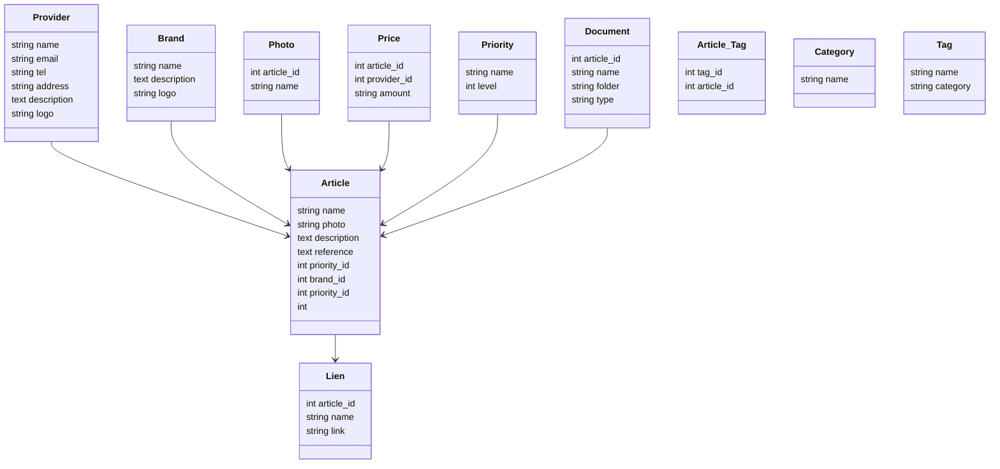

# Diagramme

```mermaid
classDiagram

Provider --> Article
Brand --> Article
Photo --> Article
Price --> Article
Priority --> Article
Document --> Article
Article --> Lien

class Provider{
    string name
    string email
    string tel
    string address
    text description
    string logo
}

class Brand{
    string name
    text description
    string logo
}

class Article{
    string name
    string photo
    
    text description
    text reference

    int priority_id
    int brand_id
    int priority_id
    int 
}

class Photo{
    int article_id
    string name
}

class Lien{
    int article_id
    string name
    string link
}

class Document{
    int article_id
    string name
    string folder
    string type
}

class Priority{
    string name
    int level
}

class Price{
    int article_id
    int provider_id
    string amount
}

class Article_Tag{
    int tag_id
    int article_id
}

class Category{
    string name
}

class Tag{
    string name
    string category
}

```
